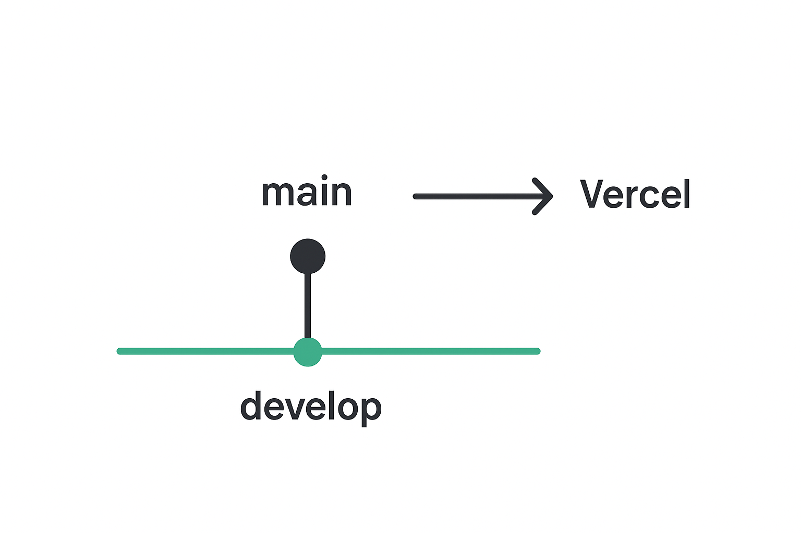

## Como começar

Primeiro, execute o servidor de desenvolvimento:

```bash
node: v24
npm i
npm run dev
```

Abra [http://localhost:3000](http://localhost:3000) no seu navegador para ver o resultado.

## Regras do Linter

Este projeto utiliza o ESLint para garantir boas práticas de codificação. A seguir estão as regras definidas para o código, com foco em estilo, legibilidade, organização de imports, boas práticas de React e TypeScript, e acessibilidade.

### **Estilo de Código**

- **`semi: ["error", "always"]`**  
  Exige o uso de ponto e vírgula no final de todas as instruções, promovendo um estilo consistente e evitando erros de interpretação.

- **`quotes: ["error", "double"]`**  
  Exige o uso de **aspas duplas** para strings, ajudando a manter a consistência no código.

- **`prefer-arrow-callback: "error"`**  
  Exige o uso de **arrow functions** para callbacks, resultando em um código mais limpo e conciso.

- **`prefer-template: "error"`**  
  Exige o uso de **template literals** (`${}`) para concatenar strings, ao invés de usar o operador `+`.

- **`camelcase: ["error", { properties: "always" }]`**  
  Exige que as variáveis e propriedades sigam a notação **camelCase**.

### **Legibilidade**

- **`max-lines-per-function: ["warn", 150]`**  
  Emite um **aviso** quando uma função ultrapassa 150 linhas, incentivando funções menores e mais fáceis de entender.

- **`complexity: ["warn", 15]`**  
  Emite um **aviso** quando a complexidade de uma função é maior que 15, indicando que a função pode ser muito difícil de manter.

- **`no-console: "warn"`**  
  Emite um **aviso** quando a função `console.log` é utilizada, evitando que logs de desenvolvimento fiquem no código de produção.

- **`no-nested-ternary: "warn"`**  
  Emite um **aviso** quando um operador ternário é aninhado, o que pode reduzir a legibilidade do código.

- **`prefer-const: "warn"`**  
  Emite um **aviso** quando uma variável declarada com `let` não é reatribuída, sugerindo o uso de `const`.

- **`react/display-name: "warn"`**  
  Emite um **aviso** quando componentes React não possuem um nome de exibição, o que facilita a depuração.

### **Importação e Organização**

- **`import/order: ["warn", { groups: [...] }]`**  
  Emite um **aviso** quando as importações não são organizadas de forma padrão, dividindo-as em grupos: `builtin`, `external`, `internal`, e `[parent, sibling, index]`.

- **`unused-imports/no-unused-imports: "error"`**  
  Marca como **erro** o uso de importações não utilizadas, incentivando a limpeza do código.

- **`unused-imports/no-unused-vars: ["warn", { vars: "all", varsIgnorePattern: "^_", argsIgnorePattern: "^_" }]`**  
  Emite um **aviso** sobre variáveis não utilizadas, exceto aquelas iniciadas com `_`, que são comumente usadas como placeholders.

### **React e Hooks**

- **`react-hooks/rules-of-hooks: "error"`**  
  Garante que os hooks do React sejam usados corretamente, em conformidade com as regras estabelecidas.

- **`react-hooks/exhaustive-deps: "warn"`**  
  Emite um **aviso** quando as dependências de hooks não estão completas ou incorretas, prevenindo comportamentos inesperados.

- **`react/jsx-uses-react: "off"`**  
  Desabilita a exigência do `React` no escopo ao usar JSX, pois o Next.js gerencia isso automaticamente.

- **`react/react-in-jsx-scope: "off"`**  
  Desabilita a exigência de ter `React` no escopo, já que no Next.js isso não é necessário.

- **`react/prop-types: "off"`**  
  Desabilita a verificação de `prop-types`, uma vez que o TypeScript já realiza a validação de tipos.

### **TypeScript**

- **`@typescript-eslint/explicit-function-return-type: "warn"`**  
  Emite um **aviso** quando funções não possuem tipo de retorno explícito, incentivando a clareza no código.

- **`@typescript-eslint/no-unused-vars: ["warn", { argsIgnorePattern: "^_" }]`**  
  Emite um **aviso** para variáveis não utilizadas, exceto aquelas que começam com `_`, geralmente usadas como placeholders.

### **Acessibilidade**

- **`jsx-a11y/click-events-have-key-events: "warn"`**  
  Emite um **aviso** quando eventos de clique (`onClick`) não têm um evento de teclado correspondente (como `onKeyDown` ou `onKeyUp`), tornando a interface acessível a usuários de teclado.

- **`jsx-a11y/no-static-element-interactions: "warn"`**  
  Emite um **aviso** quando elementos estáticos (`div`, `span`) possuem eventos interativos (como `onClick`), mas não têm semântica ou suporte de acessibilidade.

- **`jsx-a11y/aria-role: "warn"`**  
  Emite um **aviso** quando elementos interativos não possuem um papel ARIA apropriado, essencial para melhorar a acessibilidade.

- **`jsx-a11y/no-autofocus: "warn"`**  
  Emite um **aviso** quando o atributo `autofocus` é utilizado, já que pode interferir na experiência de usuários com deficiência.

Essas regras ajudam a manter o código **limpo**, **legível**, **acessível** e **organizado**, seguindo as melhores práticas ao trabalhar com **React** e **TypeScript**.

---

## **Padrão de Commits**
Este projeto utiliza o **GitFlow** como estratégia de branching e segue um padrão inspirado em Conventional Commits para os commits. Esse padrão organiza melhor o histórico de alterações, facilita a revisão de código e permite identificar rapidamente o tipo de mudança realizada.

### **Estrutura do commit**

Cada commit segue a seguinte estrutura:
```
<tipo>(<escopo opcional>): <descrição curta>
```

Tipos mais utilizados: feat, fix, docs...

 - **`Exemplos de commits no projeto:`**: 
 ```
feat(mask): Implementação de máscaras para validar os dados dos inputs
fix(hook): Ajuste do hook para lidar com a nova pesquisa
feat(consultor): Criação do cadastro de consultor
fix(table): Ajuste do contorno da tabela
feat(delete): Implementação da tela de remoção de usuários
```
---
### **Padrão de desenvolvimento**
A montagem do ambiente de desenvolvimento foi feita inicialmente na main. A partir dai a main foi conectada ao Vercel e foi criado a develop.
Toda nova feature ou correção foi feita na develop e posteriormente mergiada com a main para ir para produção.



---